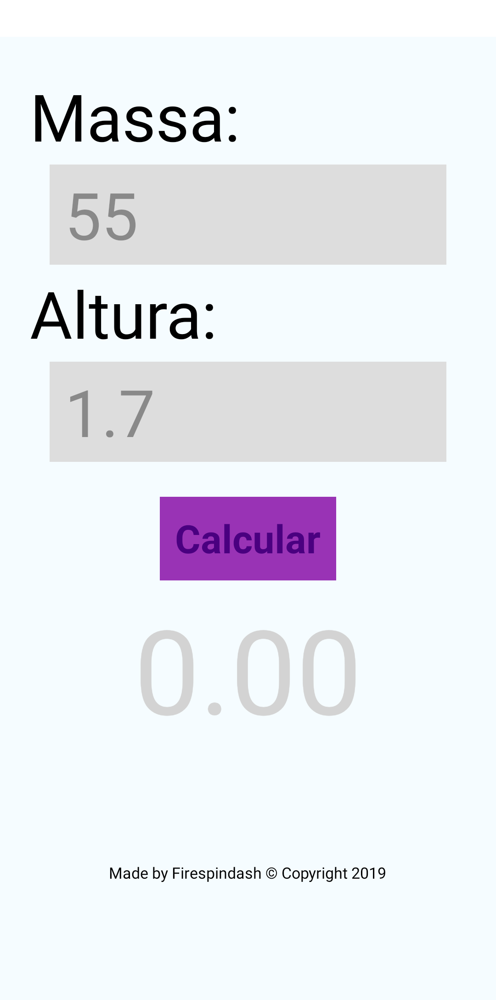

# imc-calculator
An BMI calculator to help you stay at the right weight. 

Screenshot of the app on *Android*:

## Run
If you want to run it, download the repository, then type in terminal `npm install`. If there are outdated packages you can use `npm-ckeck-updates -u` and then `npm install`, shortly after you can run it with `npm start`.

## Development
The main file of the application is *App.js*. It uses mainly *expo*, *react-native* and  *nodejs*. Type in terminal `npm start --android` to run the android version or type `npm start --ios` to run the ios version(not tested by me yet). For major troubles, see the [expo documentation](https://docs.expo.io/). This app was originally make for portuguese speakers, for instance, IMC stands for BMI in portuguese.
